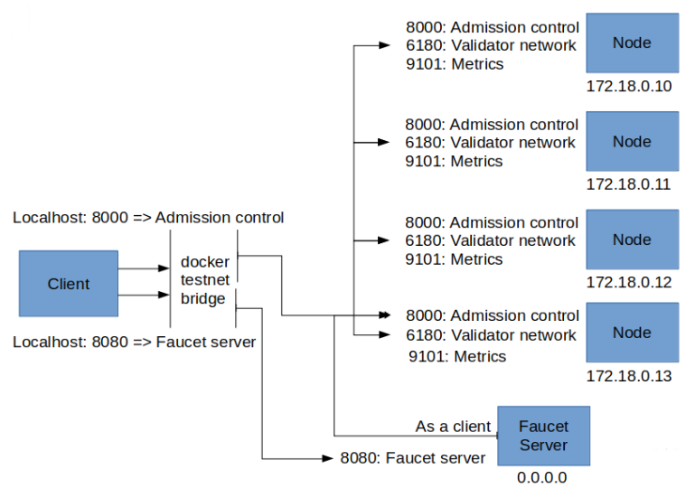

Libra Core is the official name for the open-source implementation of the Libra protocol published by the Libra Association.

* This software is the first implementation of the Libra protocol and the Move language.
* Libra Core includes both validator and client functionalities.
* Libra Core is written in Rust.

The overview picture for libra network architecture on docker development environment.

## Component READMEs of Libra Core

* [Admission Control](crates/admission-control.md)
* [Bytecode Verifier](crates/bytecode-verifier.md)
* [Consensus](crates/consensus.md)
* [Crypto](crates/crypto.md)
* [Execution](crates/execution.md)
* [Mempool](crates/mempool.md)
* [Move IR Compiler](crates/ir-to-bytecode.md)
* [Move Language](crates/move-language.md)
* [Network](crates/network.md)
* [Storage](crates/storage.md)
* [Virtual Machine](crates/vm.md)
