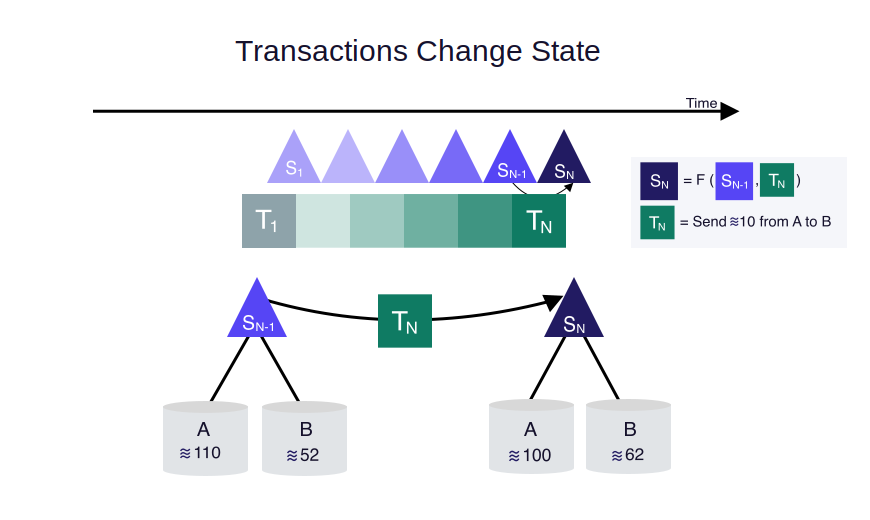
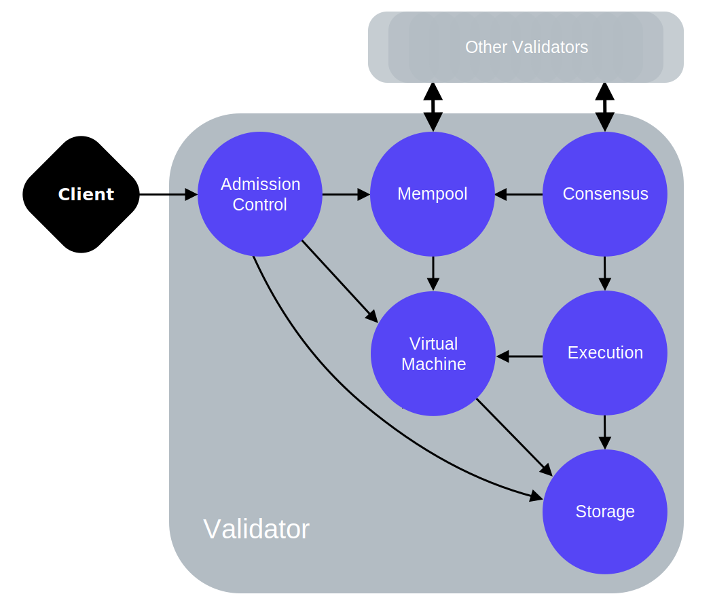

## Overview

The **Libra Blockchain**, a cryptographically authenticated distributed database, is based on the **Libra protocol**. The blockchain is maintained by a distributed network of [validators](reference/glossary/#validators). The validators collectively follow a [consensus protocol](reference/glossary/#consensus-protocol) to agree on a total ordering of transactions in the blockchain. In this document, we introduce you to the key concepts of the Libra protocol. 

The Libra **testnet** is a demonstration of an early prototype of the Libra Blockchain software (Libra Core).

## Transactions and States

At the heart of the Libra protocol are two fundamental concepts - **transactions** and **states**. At any point in time, the blockchain has a "state". The state represents the current snapshot of data on the chain. Executing a transaction changes the state of the blockchain. 

<small>Figure 1.1 A transaction changes state.</small>

Figure 1.1 represents change of state of the Libra Blockchain, when a transaction is executed.  For example, at state Sn-1, Alice has a balance of 110 and Bob has a balance of 52. When a transaction is applied to the blockchain, it generates a new state. To transition from Sn-1 to Sn, transaction Tn is applied against the state Sn-1. This causes Alice's balance to be reduced by 10 and Bob's balance to be increased by 10. The new state Sn now shows these updated balances. In figure 1.1:

* **A** and **B** represent Alice and Bob's account in the blockchain.
* **Sn-1** represents the (n-1)-th state of the blockchain.
* **Tn** is the n-th transaction executed on the blockchain.  
    * In this example it is - “send 10 Libra from person A's account to person B's account”
* **F** is a deterministic function. F always returns the same final state, for a specific initial state, and a specific transaction. If the current state of the blockchain is Sn-1, and transaction Tn is executed on state Sn-1, the new state of the blockchain is _**always**_ Sn.
* **Sn** is the n-th state of the blockchain. Sn is an outcome of applying F to Sn-1 and Tn.* *The Libra protocol uses the [Move language](reference/glossary#move-language) to implement the deterministic execution function F.

### Transactions

Clients of the Libra Blockchain submit transactions to request updates to the ledger state. A signed transaction on the  blockchain contains:

* **Sender address** - Account address of the sender of the transaction.
* **Sender public key** - The public key that corresponds to the private key used to sign the transaction.
* **Program**  - The program is comprised of:
    * A Move bytecode transaction script. Here is an example of a [peer to peer transaction script](life-of-a-transaction/#peer-to-peer-transaction-script-and-inputs). The information about the **recipient** of the transaction is part of the inputs to this script.
    * An optional list of inputs to the script, which contains the information about the recipient and the amount transfered to the recipient.
    * An optional list of Move bytecode modules to publish. 
* **Gas price** - The Libra amount the sender is willing to pay per unit of [gas](reference/glossary#gas), to execute the transaction.
* **Maximum gas amount** - The maximum units of gas the transaction is allowed to consume before halting.
* **Sequence number** - An unsigned integer that must be equal to the sequence number stored under the **sender's account**.
* **Expiration time** - The time after which the transaction ceases to be valid.
* **Signature** - The digital signature of the sender.

The *transaction script* is an arbitrary program that encodes the logic of a transaction, and interacts with resources published in the distributed database of the Libra blockchain. 

### Ledger State

The **ledger state**, or global state of the Libra Blockchain, is comprised of the state of all accounts in the blockchain. The state of each account is comprised of both code and data. Each validator must know the global state of the latest version to execute transactions. See [versioned database](reference/glossary#versioned-database).

## Versioned Database

All data in the Libra Blockchain is stored/persisted in a single, versioned, distributed database. A version number is an unsigned 64-bit integer, which corresponds to the number of transactions the system has executed.

The versioned database allows validators to:

* Execute a transaction against the **ledger state** at the latest version.
* Respond to client queries about **ledger history** at both current and previous versions.

## Account

A Libra account is a container for Move modules and Move resources. It is identified by an [account address](reference/glossary#account-address).  This essentially means that the state of each account is comprised of both code and data: 

* **Move modules** contain code (type and procedure declarations), but they do not contain data. The procedures of a module encode the rules for updating the global state of the blockchain. Here is an example of [a Move module](reference/glossary#move-module).
* **Move resources** contain data, but no code. Every resource value has a type that is declared in a module published in the distributed database of the blockchain. Here is an example of [a Move resource](reference/glossary#move-resource).

An account may contain an arbitrary number of resources and modules.  Every non-empty account contains a [`LibraAccount.T`](reference/glossary#libraaccount.t) resource.

#### Account Address

The address of a Libra account is a 256-bit value. Users can claim addresses using digital signatures. The account address is a cryptographic hash of a user's public verification key. To sign a transaction sent from their account address, the user can use the corresponding private key. 

There is no limit on the number of addresses a Libra user can claim. To claim an account address, a transaction should be sent from an account that holds sufficient Libra, to pay the account creation fee.

## Proof

All the data in the Libra Blockchain is stored in a single versioned database. The storage is used to persist **agreed upon** blocks of transactions and their execution results. The blockchain is represented as an ever-growing [Merkle tree of transactions](reference/glossary#merkle-tree). A “leaf” is appended to the tree for each transaction executed on the blockchain.

* A proof is a way to verify the truth of data in the Libra Blockchain. 
* Every operation stored on the blockchain can be verified cryptographically, and the resultant proof will also prove that no data has been omitted. For example, if the client queried the latest n transactions from an account, the proof will verify that no transactions are omitted from the query response.

In a blockchain the client does not need trust the entity from which it is receiving data. A client could query for the balance of an account, ask whether a specific transaction was processed, and so on. Like other Merkle trees, the ledger history can provide an O(log n) sized proof of a specific transaction object, where n is the total number of transactions processed.

## Validator

Clients of the Libra Blockchain create transactions, and submit them to a Validator. A Validator runs a consensus protocol (together with other validators), executes the transactions, and stores the transactions and the execution results in the distributed database of the blockchain. Validators decide which transactions will be added to the blockchain, and in which order.

<small>Figure 1.1 Logical components of a validator.</small>

 A validator contains the following logical components:

**Admission Control (AC)**

* Admission Control is the <u>sole external interface</u> of the validator. Any request made by a client to the validator goes to AC first. 
* AC performs initial checks on the requests to protect the other parts of the validator from corrupt or high volume input.

**Mempool**

* Mempool is in-memory buffer that holds the transactions that are ‘waiting’ to be executed. 
* When a new transaction is added to the mempool, the mempool shares this transaction with other validators in the system. 

**Consensus**

* The consensus component is responsible for ordering blocks of transactions, and agreeing on the results of execution by participating in the [consensus protocol](reference/glossary#consensu) with other validators in the network.

**Execution**

* The execution component utilizes the virtual machine (VM) to execute transactions.
* Execution's job is to coordinate execution of a block of transactions and maintain a transient state that can be voted upon by consensus.
* Execution maintains an in-memory representation of the results of execution until consensus commits the block to the distributed database.

**Virtual Machine (VM)**

* AC and Mempool use the VM component to perform validation checks on transactions.
* VM is used to run the program included in a transaction and determine the results.

**Storage**

* The storage is used to persist *agreed upon* blocks of transactions and their execution results.

For information on interactions of each validator component with other components refer to [Life of a Transaction](life-of-a-transaction).

## Reference

* For a detailed description of the Libra protocol and the design decisions, refer to the [Libra Blockchain technical paper](papers/the-libra-blockchain). 
* For an introduction to the Libra ecosystem refer to [Introduction to Libra](welcome). 
* To run a transaction on testnet refer to [My First Transaction](my-first-transaction). 
* For a deeper look at the lifecycle of a Libra transaction refer to [Life of a Transaction](life-of-a-transaction).
* To learn about the concept and implementation details of the Libra Core components and the associated API documentation refer to [Libra Core  Overview](libra-core-overview).
* The [CLI guide](cli-guide) lists the commands (and their usage) to help you connect to the testnet through a CLI client, and interact with the Libra Blockchain.
* Move is a new blockchain programming language. You can refer to the following documents for more information on Move:
    * [Move - Overview](move-overview) - for an introduction to Move. 
    * [Move: a language with safe programmable assets](papers/the-move-language) - the technical paper, for a detailed technical understanding of Move.
* [Glossary](glossary) is a quick reference for Libra terminology.

> *Note*: In this document the term "State" or "ledger state" refers to the <u>global state</u> of the distributed-database that persists the Libra Blockchain. “User” refers to an end-user who uses a Libra client to interact with the blockchain. “Blockchain” or “blockchain” refers to the Libra Blockchain.

