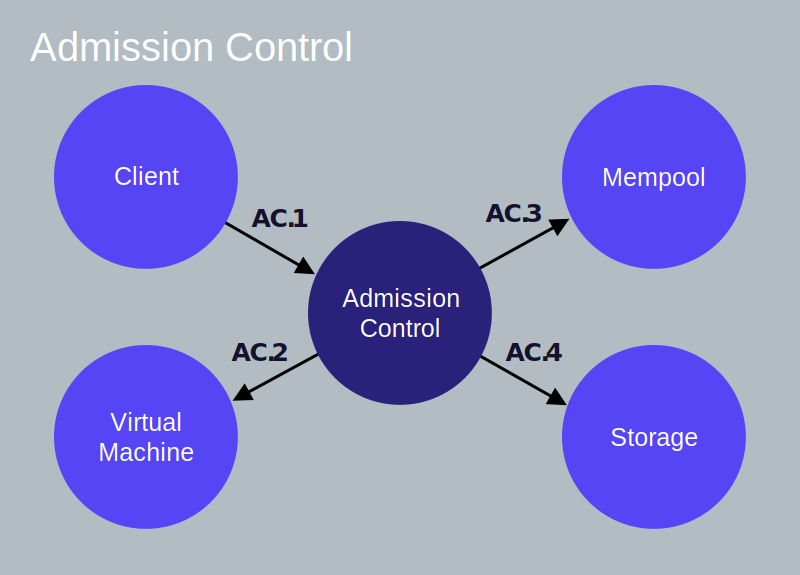
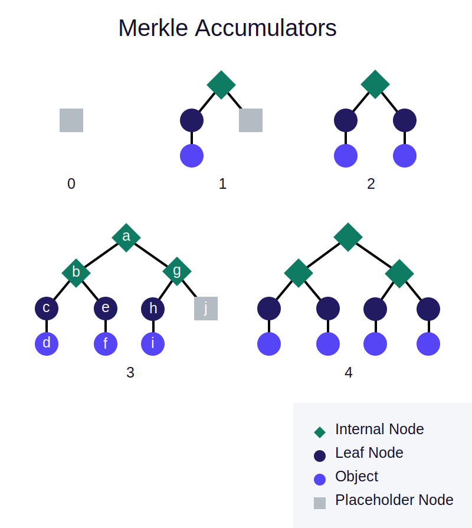

## Overview

To get a deeper understanding of the lifecycle of a Libra transaction, we will follow a transaction on its journey from being submitted to a Libra validator to being committed into the Libra Blockchain. We will then “zoom-in” on each logical component of a validator and take a look at its interactions with other components.

## Client Submits a Transaction

A Libra **client constructs a raw transaction** (let us call it T~5~raw) to transfer 10 Libra from Alice's account to Bob's account. The raw transaction includes the following fields. Each field is linked to its glossary definition.

* Alice's [account address](reference/glossary.md#account-address).
* A program that indicates the actions to be performed on Alice's behalf. It contains:
    * A Move bytecode [peer-to-peer transaction script](reference/glossary.md#transaction-script).
    * A list of inputs to the script (for this example, Bob's account address and the amount of payment).
* [Gas price](reference/glossary.md#gas-price) (in microlibra/gas units) - The amount Alice is willing to pay per unit of gas, to execute the transaction. Gas is a way to pay for computation and storage. A gas unit is an abstract measurement of computation with no inherent real-world value.
* [Maximum gas amount](reference/glossary.md#maximum-gas-amount) Alice is willing to pay for this transaction.
* [Expiration time](reference/glossary.md#expiration-time) of the transaction.
* [Sequence number](reference/glossary.md#sequence-numnber) - 5
    * A transaction with sequence number 5 can only be applied to an account with sequence number 5.

The **client signs transaction** T~5~raw with Alice's private key. The signed transaction T~5~ includes the following:

* The raw transaction.
* Alice's public key.
* Alice's signature.

### Assumptions

To describe the lifecycle of transaction T~5~ we will assume that:

* Alice and Bob have [accounts](reference/glossary.md#accounts) on the Libra Blockchain.
* Alice's account has 110 Libra.
* The current [sequence number](reference/glossary.md#sequence-number) of Alice's account is 5 (which indicates that 5 transactions have already been sent from Alice's account).
* There are a total of 100 validators - V~1~ to V~100~ on the network.
* The client submits transaction T~5~ to validator V~1~
* **Validator V~1~ is a proposer/leader for the current round.**

## Lifecycle Of The Transaction

In this section, we will describe the lifecycle of transaction T~5~ from being submitted by the client to being committed into the Libra Blockchain.

Where relevant, and following a numbered step in the lifecycle, we have provided a link to the corresponding inter-component interaction(s) of the validator node. After you are familiar with all the steps in the lifecycle of the transaction, you may want to refer to the information on the corresponding inter-component interaction(s) for each step.


<small>Figure 1.1 Lifecycle of a Transaction</small>

### Accepting The Transaction

**1** - The client submits transaction T~5~ to validator V~1~ whose admission control (AC) component receives the transaction. (Client → AC [AC.1](#client-ac-ac1))

**2** - AC will use the virtual machine (VM) component to perform validation checks such as signature verification, checking if Alice's account has sufficient balance, checking that transaction T~5~ is not being replayed, etc. (AC → VM [AC.2](#ac-vm-ac2), [VM.1](#ac-vm-vm1))

**3** - When T~5~ passes the validation checks, AC sends T~5~ to V~1~'s mempool. (AC → Mempool [AC.3](#ac-mempool-ac3), [MP.1](#ac-mempool-mp1))

### Sharing the transaction with other validators

**4** - The mempool will hold T~5~ in an in-memory buffer. Mempool may already contain multiple transactions sent from Alice's address.

**5** - Using the shared-mempool protocol, V~1~ will share the transactions (including T~5~) in its mempool with other validators (V~2~ to V~100~) and place transactions received from the other validators into its own mempool. (Mempool → Other Validators [MP.2](#mempool-other-validators-mp2))

### Proposing The Block

**6** - As validator V~1~ is a proposer/leader, it will pull a block of transactions from its mempool and replicate this block as a proposal to other validators via its consensus component. (Consensus → Mempool [MP.3](#consensus-mempool-mp3), [CO.1](#consensus-mempool-co1))

**7** - The consensus component of V~1~ is responsible for coordinating agreement among all validators on the order of transactions in the proposed block. (Consensus → Other Validators [CO.2](#consensus-other-validators-co2))

### Executing Block and Reaching Consensus

**8** - As part of reaching agreement, the block of transactions (containing T~5~) is passed to the execution component. (Consensus → Execution [CO.3](#consensus-execution-consensus-other-validators-co3), [EX.1](#consensus-execution-ex1))

**9** - The execution component manages the execution of transactions in the virtual machine (VM). Note that this execution happens speculatively, before the transactions in the block have been agreed upon. (Execution → VM [EX.2](#execution-vm-ex2), [VM.3](#execution-vm-vm3))

**10** - After executing the transactions in the block, the execution component appends the transactions in the block (including T~5~) to the [Merkle accumulator](#merkle-accumulators) (of the ledger history). This is an in-memory/temporary version of the Merkle accumulator. The (proposed/speculative) result of executing these transactions is returned to the consensus component. (Consensus → Execution [CO.3](#consensus-execution-consensus-other-validators-co3), [EX.1](#consensus-execution-ex1))

**11** - V~1~ (the consensus leader) attempts to reach consensus on the block's execution result with other validators participating in the consensus. (Consensus → Other Validators [CO.3](#consensus-execution-consensus-other-validators-co3))

### Committing The Block

**12** - If the block's execution result is agreed upon and signed by a set of validators which have the super-majority of votes, validator V~1~'s execution component reads the result of the block execution from the speculative execution cache and commits all the transactions in the block to persistent storage. (Consensus → Execution [CO.4](#consensus-execution-co4), [EX.3](#consensus-execution-ex3)), (Execution → Storage [EX.4](#execution-storage-ex4), [ST.3](#execution-storage-st3))

**13** - Alice's account will now have 100 Libra and its sequence number will be 6. If T~5~ is replayed by Bob it will be rejected as the sequence number of Alice's account (6) is greater than the sequence number of the replayed transaction (5).

## Validator Component Interactions

In the [Libra Protocol - Key Concepts](libra-protocol#transactions) document we looked at the structure of a transaction, and mentioned that:

* Clients of the Libra Blockchain submit transactions to request updates to the ledger state.
* These transactions are submitted to a Libra validator node.

In the [previous section](#lifecycle-of-a-transaction), we described the typical lifecycle of a sample transaction from being submitted, to being committed, to the blockchain/distributed database. Now let's look at the inter-component interactions of a validator as the validator processes transactions and reads queries.  This information is useful to you if:

* You would like to get an overall idea of how the system works under the covers.
* You are interested in eventually contributing to the Libra Core software.

For our narrative, we will assume that a client submits a  transaction T~N~ to a validator V~X~. For each validator component we will describe each of its inter-component interaction in “ACTION” subsections. Note that the “ACTIONS” are not listed strictly in the order in which they are performed. Most of the interactions are relevant to the processing of a transaction, and a few are relevant to read queries by the client (for existing information on the blockchain).

 Let us look at each logical component of a validator node:

* [Admission Control](#admission-control-ac)
* [Mempool](#mempool)
* [Consensus](#consensus)
* [Execution](#execution)
* [Virtual Machine](#virtual-machine-vm)
* [Storage](#storage)

A link to the “README” of the [Libra Core](reference/glossary.md#libra-core) crate that corresponds to each of these validator components is provided at the end of the corresponding section.

### Use of arrows in the diagrams

The arrows in the following graphics start on the component initiating an interaction/action and end on the component on which the action is being performed. The arrows _do not represent_ data or information exchanged (read, written, or returned).

## Admission Control (AC)


<small>Figure 1.2 Admission Control</small>

Admission Control is the _sole external interface_ of the validator. Any request made by a client to the validator goes to AC first.

### Client → AC (AC.1)

A client submits a  transaction to the admission control of a validator V~X~. This is done via:
`AC::SubmitTransaction()`

### AC → VM (AC.2)

The admission control accesses the virtual machine (VM) of the validator to perform preliminary checks on the transaction, to reject malformed transactions early. This is done via:
 [`VM::ValidateTransaction()`](#virtual-machine-b).

### AC → Mempool (AC.3)

Once `VM::ValidateTransaction()` returns without errors AC forwards the transaction to validator V~X~ 's mempool via:

`Mempool::AddTransactionWithValidation().` The mempool for validator V~X~ will accept the transaction T~N~ from the AC only if the sequence number of T~N~ is greater than or equal to the current sequence number of the sender's account.

### AC → Storage (AC.4)

When the client performs a read query on the Libra Blockchain, (for example, get the balance of Alice's account) AC interacts with the storage component directly to obtain the information.

### Admission Control README

For implementation details, repository structure, and API of the admission control crate of Libra Core software refer to the [Admission Control README](crates/admission-control.md).

## Virtual Machine (VM)


<small>Figure 1.3 Virtual Machine</small>

AC and mempool use VM to perform validation checks on transactions. VM (also called [Move VM](move-getting-started.md)) is used to run the program included in a transaction and determine the results.

### AC → VM (VM.1)

When admission control of validator V~X~ receives a transaction from a client, it invokes `VM::ValidateTransaction()` on the VM to validate the transaction.

### VM → Storage (VM.2)

When AC or mempool request VM to validate a transaction via
`VM::ValidateTransaction(),` VM loads the transaction sender's account from storage and performs the following verifications:

* Checks that the input signature(s) on the signed transaction are correct (to reject incorrectly signed transactions).
* Checks that the sender's account authentication key is same as the hash of the public key (corresponding to the private key used to sign the transaction).
* Verifies that the sequence number for the transaction is not less than the current sequence number for the sender's account.  Doing this check prevents replay of the same transaction against the sender's account.
* Verifies that the program in the signed transaction is not malformed, as a malformed program cannot be executed by the VM.
* Verifies that there is sufficient balance in the sender's account to support the max gas amount specified in the transaction (this avoids spam transactions).

### Execution → VM (VM.3)

The execution component invokes VM to execute a transaction via:
`VM::ExecuteTransaction()`

It is important to understand that executing a transaction is different from updating the state of the ledger (persisting the results in storage). A transaction T~N~ is first executed as part of an attempt to reach agreement on its sequencing within the blockchain. If agreement is reached with the other validators, on the ordering of transactions and the execution results, the results/output is written to the ledger.

### Mempool → VM (VM.4)

When mempool receives a transaction from other validators, mempool invokes [`VM::ValidateTransaction()`](#action-b-1) on the VM to validate the transaction.

### VM README

For implementation details, repository structure, and external API for the virtual machine module refet to the [Virtual Machine README](crates/vm.md).

## Mempool


<small>Figure 1.4 Mempool</small>

Mempool is a shared buffer that holds the transactions that are ‘waiting’ to be executed. When a new transaction is added to the mempool, the mempool shares this transaction with other validators in the system. To reduce network consumption in the “shared mempool”, each validator is responsible for delivering its own transactions to other validators. When a validator receives a transaction from the mempool of another validator, the transaction is added to the ordered queue of the recipient validator. The mempool does not push transactions to consensus, the consensus pulls transactions from mempool. When a transaction is fully executed and written to storage, consensus notifies mempool, and mempool drops that transaction from its internal state.

### AC → Mempool (MP.1)

* After performing initial validation checks,  AC sends a transaction to the mempool of the validator.
* The mempool for a validator V~X~ accepts the transaction T~N~ from the admission control, for the sender's account, only if the sequence number of T~N~ is greater than or equal to the current sequence number of the sender's account.

### Mempool → Other Validators (MP.2)

* The mempool of validator V~X~ shares the transaction T~N~ with the other validators on the same network.
* Other validators share the transactions in their mempool with V~X~'s mempool.

### Consensus → Mempool (MP.3)

* When validator V~X~ becomes the leader, its consensus will pull a block of transactions from its mempool and broadcast the block to other validators. *It does this* to arrive at a consensus on the ordering of transactions and the execution results of the transactions in the block.
* If the gas price is a tie between two transactions, then they are ordered by how long ago they were submitted.
* Note that just because a transaction T~N~ was included in a consensus block it does not guarantee that T~N~ will eventually be persisted in the distributed database of the blockchain.

### Mempool → VM (MP.4)

When mempool receives a transaction from other validators, mempool invokes [`VM::ValidateTransaction()`](#action-b-1) on the VM to validate the transaction.

### Mempool README

For implementation details,  repository, and API of the mempool crate refer to the [Mempool README](crates/mempool).

## Consensus


<small>Figure 1.5 Consensus</small>

The consensus component is responsible for ordering blocks of transactions, and agreeing on the results of execution by participating in the [consensus protocol](#consensus-protocol) with other validators in the network.

### Consensus → Mempool (CO.1)

* When validator V~X~ is a leader/proposer, the consensus of V~X~ pulls a block of transactions from its mempool via: `Mempool::GetBlock()`, and forms a proposal.
* `Mempool::GetBlock()` pulls transactions out of mempool in a way that if sequential transactions (transactions which have their sequence numbers in a sequence, for a single account) are sitting in mempool they will be added to the ordered queue.

### Consensus → Other Validators (CO.2)

* If V~X~ is a proposer/leader, its consensus sends the proposed block of transactions (containing T~N~) to other validators.

### Consensus → Execution, Consensus → Other Validators (CO.3)

* To execute a block of transactions consensus interacts with the execution component . Consensus executes a block of transactions via: `Execution:ExecuteBlock()`(Refer to Execution →  [Action A](#action-a))
* When execution computes the speculative root hash, it responds to consensus with this new root hash.
* Consensus signs this root hash and attempts to reach agreement on this root hash with other validators participating in consensus.

### Consensus → Execution (CO.4)

* If enough validators vote for the same root hash, consensus of V~X~ informs execution via:  `Execution::CommitBlock()`that this block is ready to be committed

### Consensus README

For implementation details, repository structure, and API of the consensus crate refer to the [Consensus README](crates/consensus.md).

## Execution


<small>Figure 1.6 Execution</small>

Execution's job is to coordinate the execution of a block of transactions and maintain a transient state that can be voted upon by consensus.

### Consensus → Execution (EX.1)

*  Consensus requests execution to execute a block of transactions via: `Execution::ExecuteBlock()`.
* Execution maintains a “scratchpad” which holds in memory copies of the relevant portions of the [Merkle accumulators](#merkle-accumulators). This information is used to calculate the root hash of the current state of the blockchain.
* The root hash of the current state is combined with the information about the transactions in the block to determine the new root hash of the accumulator. This is done prior to persisting any data, this ensures that no state or transaction is stored until agreement is reached by a quorum of validators.
* Execution computes the speculative root hash and then consensus of V~X~ signs this root hash and attempts to reach agreement on this root hash with other validators.

### Execution → VM (EX.2)

When Consensus requests execution to execute a block of transactions via: `Execution::ExecuteBlock(),`
execution uses the VM to determine the changes to the current state.

### Consensus → Execution (EX.3)

* If enough nodes vote for the same root hash, consensus of V~X~ informs its execution module via `Execution::CommitBlock() `that this block is ready to be committed.
* `Execution::CommitBlock()`will include the signatures of the validators who voted for this block (the signatures that signed the root hash of the accumulator).

### Execution → Storage (EX.4)

* Execution takes the values from scratchpad and sends them to storage for persistence via: `Storage::SaveTransactions()`.
* Execution clears the old values from the scratchpad that are no longer needed (for example, parallel blocks that are not going to be committed).

### Execution README

For implementation details, repository structure, and API of the execution crate refer to the [Execution README](crates/execution).

## Storage


<small>Figure 1.7 Storage</small>

The storage persists agreed upon blocks of transactions and their execution results. A block/set of transactions (which includes transaction T~N~) will be saved to the storage when:

* There is agreement between more than 2/3rd of the validators (participating in consensus) on all of the following:
    * The transactions to include in a block.
    * The order of the transactions.
    * The execution results of the transactions to be included in the block.

Refer to [Merkle accumulators](reference/glossary.md#merkle-accumulators) for information on how a transaction is appended to the data structure representing the blockchain.

### VM → Storage (ST.1)

When AC or mempool invoke `VM::ValidateTransaction()`to validate a transaction, `VM::ValidateTransaction()` loads the sender's account from the storage and performs the read-only validity checks.

### Execution → Storage (ST.2)

When consensus calls Execution::ExecuteBlock(), execution reads the current state from storage and uses that to determine the execution results.

### Execution → Storage (ST.3)

* Once consensus is reached on a block of transactions, execution calls storage via: `Storage::SaveTransactions()` to save the block of transactions and permanently record them. This will also store the signatures from the validator nodes who agreed on this block of transactions.
* The data in the cache of the VM is passed to storage and the storage is updated (transactions are committed).
* When the storage is updated, the sequence numbers of all resources modified by transaction T~N~ are updated to the transaction's sequence number.
* Note: The sequence number of an account on the Libra Blockchain increases by one for each transaction committed on that account.

### AC → Storage (ST.4)

For any read queries by a client (to read information from the blockchain), AC directly interacts with storage to read the requested information.

### Storage README

For implementation details, repository structure, and API of the storage crate refer to the [Storage README](crates/storage.md).

## Appendix

### Peer-to-peer Transaction Script And Inputs

The following example of a Move transaction script is a pseudocode representation of a peer-to-peer transaction script for T~5~. This pseudocode is similar to the Move Intermediate Representation (IR).

```rust
main(payee: address, amount: uint) {
  let coin = 0x0.Currency.withdraw_from_sender(copy(amount));
  0x0.Currency.deposit(copy(payee), move(coin));
}
```

* `payee`, is an input to the script is the recipient Bob's account address.
* `amount`, is an input to the script is the number of Libra to be transferred to Bob's account (10 for our example).
* `withdraw_from_sender` and `deposit`are procedures of the Move module `0x0.Currency`, where `0x0` is the address of the `Currency` module.
* `coin` is a value returned by the procedure `withdraw_from_sender`. It is a linear Move resource of type `0x0.Currency.Coin`.

A transaction script **is not** stored in the global state and cannot be invoked by other transaction scripts. It is a single-use program.

For further information refer to [Getting Started with Move](move-getting-started.md)

### `Currency` module

In the sample transaction script provided above: `0X0.Currency` identifies the Currency module.

* `0X0` is the address where the module is stored
* `Currency` is the name of the module.

### `Coin` Resource

In the sample transaction script provided above:

* `coin` is a linear **resource** **value** of type `0X0.Currency.Coin.`
    * The statement - `0X0.Currency.deposit(copy(payee), move(coin));`  moves the `coin` resource value into the `0X0.Currency `module's deposit procedure.
    * The variable `coin` becomes unavailable after this  move.
* Move language implements linear resources that must be moved _exactly_ once. Failing to move a resource (deleting the the line `0X0.Currency.deposit(copy(payee), move(coin));)` will trigger a bytecode verification error.

### Consensus Protocol

* Our proposed consensus protocol, **LibraBFT**, is based on HotStuff, a Byzantine fault-tolerant (BFT) protocol.
* LibraBFT guarantees agreement on the final order of transactions (the **safety** property), provided the set of nodes deviating from the protocol (malicious nodes) is comprised of no more than a third of the total voting rights.
* LibraBFT also guarantees that blocks of transactions never stop being finalized, (the **liveness** property), as long as the network delivers consensus messages in a timely manner (in addition to satisfying the voting rights necessary for safety).
* The design of our consensus protocol is mostly independent of how clients interact with the Libra Blockchain. Transactions submitted by clients are first shared between validators by the mempool component.
* LibraBFT works by electing and rotating special nodes called leaders (validators). When its round becomes active, a leader pulls transactions from the mempool to propose a block of transactions. It is then responsible for the coordination and agreement between all validators on the proposed block to be executed (and eventually finalized).
* The Libra blockchain is formed with these agreed-upon transactions, and their corresponding execution results.
* Refer to our technical paper [State Machine Replication in the Libra Blockchain](papers/state-machine-replication.md) for details of our proposed consensus protocol LibraBFT.

For further information refer to the [Consensus technical paper](papers/state-machine-replication.md)

### Merkle Accumulators

The storage is used to persist **agreed upon** blocks of transaction and their execution results. All the data in the Libra Blockchain is stored in a single versioned database. The blockchain is represented as an ever-growing Merkle tree of transactions. A “leaf” is appended to the tree, for each transaction executed on the blockchain.


<small>Figure 1.8 Merkle Accumulator</small>

* A Merkle accumulator is an append-only Merkle tree. Figure 1.2 shows how the Merkle accumulator grows as a new `TransactionInfo` object gets appended, for each transaction executed.
    * 0 - An empty accumulator contains just a **placeholder node**.
    * 1 - Every time a transaction is executed, a new `TransactionInfo` **object** and the corresponding **leaf node** is appended to the Merkle accumulator.  Any empty subtree is replaced by a placeholder node.
    * 2 - When a new `TransactionInfo` object and l**eaf node** are added, the placeholder node is replaced.
    * 3,4 - The Merkle accumulator grows as new transactions are appended to the ledger, and empty subtrees are replaced by placeholder nodes.
* **Object** is the The `TransactionInfo` object. **Internal node** is calculated based on the leaf nodes, it is the hash of its children. **Leaf** of the Merkle accumulator is the hash of:
    * The `TransactionInfo` object.
    * The root hash of the final state the accumulator (after the transaction is applied).
    * Other metadata.
* When validators reach **consensus** on a new [block](reference/glossary.md#block) of transactions and agree on their ordering and execution results:
    * The validators append all the transactions in the block, one-by-one, to the previous accumulator and compute the new root hash of the accumulator.
    * All validators sign the root hash of the new tree.

For further information refer to [Blockchain Technical Paper](papers/the-libra-blockchain.md)

## Reference

* [Welcome page](welcome.md).
* [Libra Protocol - Key Concepts](libra-protocol.md) - Introduces you to the fundamental concepts of the Libra protocol.
* [My First Transaction](my-first-transaction.md) - Guides you through executing your very first transaction on the Libra Blockchain using the Libra CLI client.
* [Getting Started With Move](move-getting-started.md) - Introduces you to a new blockchain programming language called Move.
* [Libra Core Overview](libra-core-overview.md) - Provides the concept and implementation details of the Libra Core components through READMEs.
* [CLI Guide](reference/libra-cli.md) - Lists the commands (and their usage) of the Libra CLI client.
* [Libra Glossary](reference/glossary.md) - Provides a quick reference to Libra terminology.
