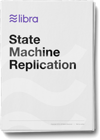

<!-- hide the table of contents -->

## Abstract

This report presents LibraBFT, a robust and efficient state machine replication system designed for the Libra Blockchain. LibraBFT is based on HotStuff, a recent Byzantine fault-tolerant (BFT) consensus protocol. Compared to HotStuff, LibraBFT introduces a new formalism and noticeable changes in the protocol. These changes result from our efforts to cover liveness mechanisms in detail and to simplify the analysis of safety and liveness. We also provide software specifications for data transfers between nodes and state replication. Finally, we discuss how to extend the protocol with economic incentives. We propose simple rules to reward timely leaders and voters and describe how to detect malicious attempts to break safety.

### Downloads

[{: .download}]()
